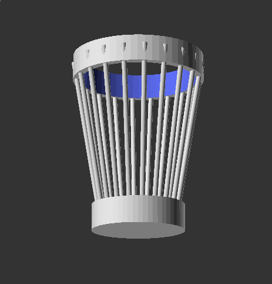
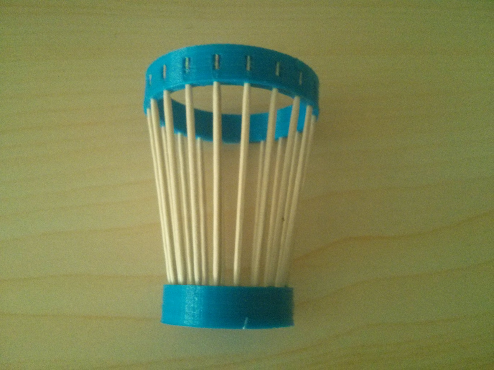

# Foraying into assembling and printing

This is a prototype to design and print a trash can using both 3d printed parts
non printed parts. This is a shot glass sized prototype. 

This prototype is designed for using toothpicks. The parts are located so that
both the pieces can be printed in a single print job. 

# Results

Expectation:

Reality:

